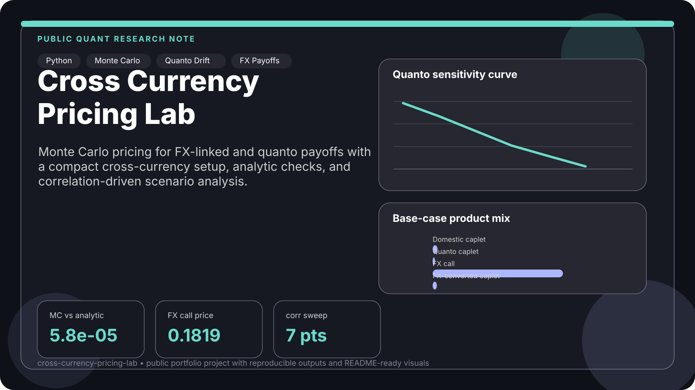
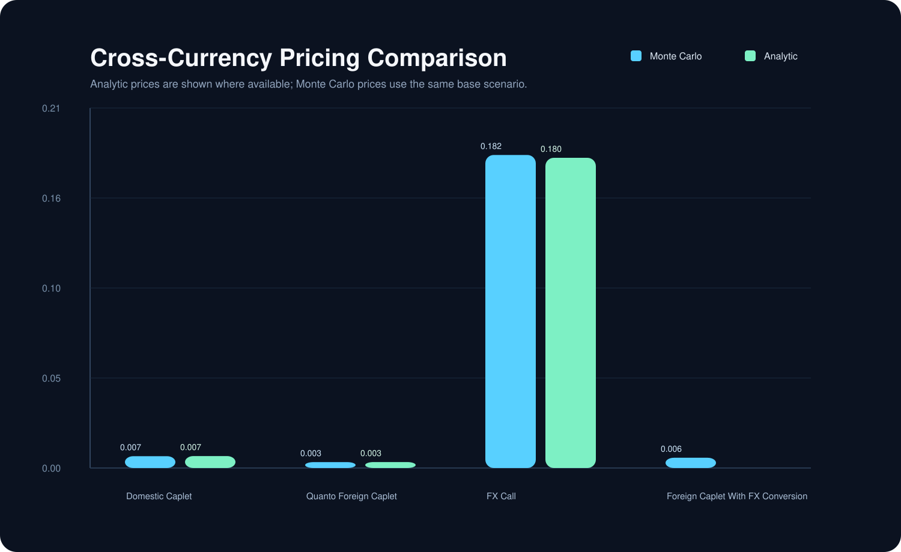
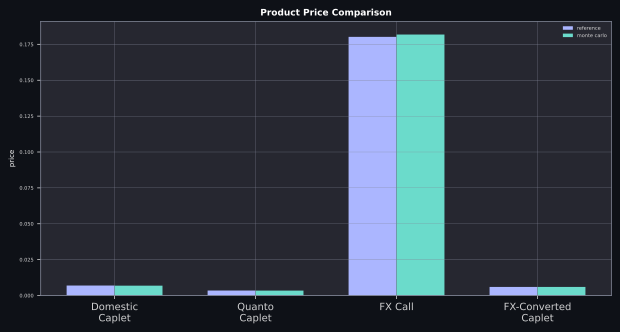
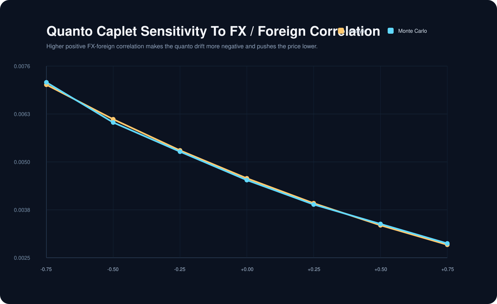
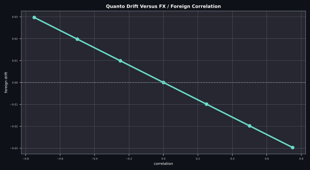

<div align="center">
  <h1>Cross Currency Pricing Lab</h1>
  <p><strong>A public-facing Monte Carlo pricing project for a simplified hybrid cross-currency model with quanto effects, FX-linked payoffs, and scenario analysis.</strong></p>
  <p>Built as a compact portfolio project with a cleaner structure and an experiment-first workflow.</p>
</div>

<p align="center">
  <code>python</code>
  <code>derivatives pricing</code>
  <code>monte carlo</code>
  <code>cross currency</code>
  <code>quanto drift</code>
  <code>fx-linked payoffs</code>
</p>



## At A Glance

| Surface | Purpose |
| --- | --- |
| Simplified model | Simulates domestic forward, foreign forward, and forward FX under a domestic terminal measure |
| Product layer | Prices domestic caplets, quanto caplets, FX calls, and FX-converted foreign payoffs |
| Analytic checks | Compares selected Monte Carlo prices against closed-form lognormal benchmarks |
| Scenario engine | Sweeps FX / foreign correlation to show the effect of quanto drift |
| Presentation outputs | Exports CSV, JSON, and SVG charts for GitHub-ready documentation |

## Overview

This project rebuilds a compact cross-currency pricing problem into a public portfolio format.
The underlying model keeps only one forward period and one terminal settlement date, which makes it small enough to explain clearly while still preserving the interesting parts of the story:

- correlated domestic and foreign forward rates
- forward FX dynamics
- measure change and quanto drift
- domestic vs FX-converted payoff settlement

The result is a pricing repo that feels more like a real derivatives lab than a classroom submission.

## Core Formulas

The repo uses a compact lognormal terminal-value setup. For a generic state variable \(X_t\),

$$
X_t = X_0 \exp\left(\left(\mu - \tfrac{1}{2}\|\lambda\|^2\right)t + \lambda^\top W_t\right).
$$

In the domestic terminal-measure view used here, the foreign forward carries the quanto drift

$$
\mu_f = - \langle \lambda_f, \lambda_{FFX} \rangle,
$$

which is the main cross-currency effect explored in the correlation sweep.

The initial forward FX level is linked to spot FX through discount factors:

$$
FFX(0,T_2) = S_0 \frac{P^f(0,T_2)}{P^d(0,T_2)}.
$$

Representative discounted payoffs in the repo are:

$$
\text{Domestic caplet} = P^d(0,T_2)\,\delta\,(F^d_{T_1} - K)^+,
$$

$$
\text{Quanto foreign caplet} = P^d(0,T_2)\,\delta\,(F^f_{T_1} - K)^+,
$$

$$
\text{FX call} = P^d(0,T_2)\,(S_{T_2} - K)^+.
$$

## What It Shows

- three-factor lognormal simulation with Cholesky-based correlation loading
- domestic terminal-measure pricing
- deterministic conversion between spot FX and forward FX
- Monte Carlo pricing with standard errors
- analytic reference prices for selected products
- scenario analysis of correlation-driven quanto effects

## Quick Start

```bash
python3 -m pip install -e .
python3 -m cross_currency_pricing_lab
```

## Example Workflow

The main experiment:

1. builds a base cross-currency scenario
2. simulates terminal domestic forward, foreign forward, and forward FX states
3. prices four products under the same model
4. compares three of them against analytic lognormal benchmarks
5. sweeps the FX / foreign correlation grid
6. writes result tables and SVG charts into `results/`

## Generated Outputs

- `results/pricing_summary.csv`
- `results/pricing_summary.json`
- `results/pricing_comparison.svg`
- `results/product_price_breakdown.svg`
- `results/quanto_correlation_sensitivity.csv`
- `results/quanto_correlation_sensitivity.json`
- `results/quanto_correlation_sensitivity.svg`
- `results/quanto_drift_profile.svg`

## Preview

<p align="center">
  
  
</p>
<p align="center">
  
  
</p>

## Example Results

| Product | Monte Carlo | Analytic | Absolute Error |
| --- | ---: | ---: | ---: |
| Domestic Caplet | 0.006869 | 0.006927 | 0.000058 |
| Quanto Foreign Caplet | 0.003421 | 0.003454 | 0.000033 |
| FX Call On Terminal Spot | 0.181861 | 0.180212 | 0.001649 |
| Foreign Caplet With FX Conversion | 0.005974 | n/a | n/a |

The base scenario behaves the way the model should:

- Monte Carlo prices stay close to analytic references for the products with closed-form checks.
- The FX-converted foreign caplet remains simulation-only, which gives the repo one payoff that feels genuinely structural rather than purely textbook.
- As `corr(FX, foreign rate)` rises, the quanto drift becomes more negative and the quanto caplet price falls.

## Project Structure

```text
cross-currency-pricing-lab/
├── pyproject.toml
├── README.md
├── assets/
│   └── cover.svg
├── results/
├── src/cross_currency_pricing_lab/
│   ├── __init__.py
│   ├── __main__.py
│   ├── charts.py
│   ├── experiments.py
│   ├── model.py
│   └── products.py
└── tests/
    └── test_pricing.py
```

## Notes

- The model intentionally keeps the tenor structure minimal so the cross-currency mechanics remain visible.
- The foreign forward rate carries a quanto drift term under the domestic terminal measure, which is the key pricing effect explored in the scenario analysis.
